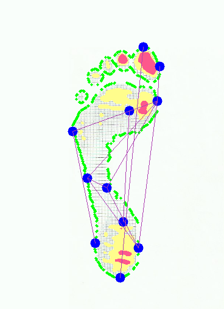
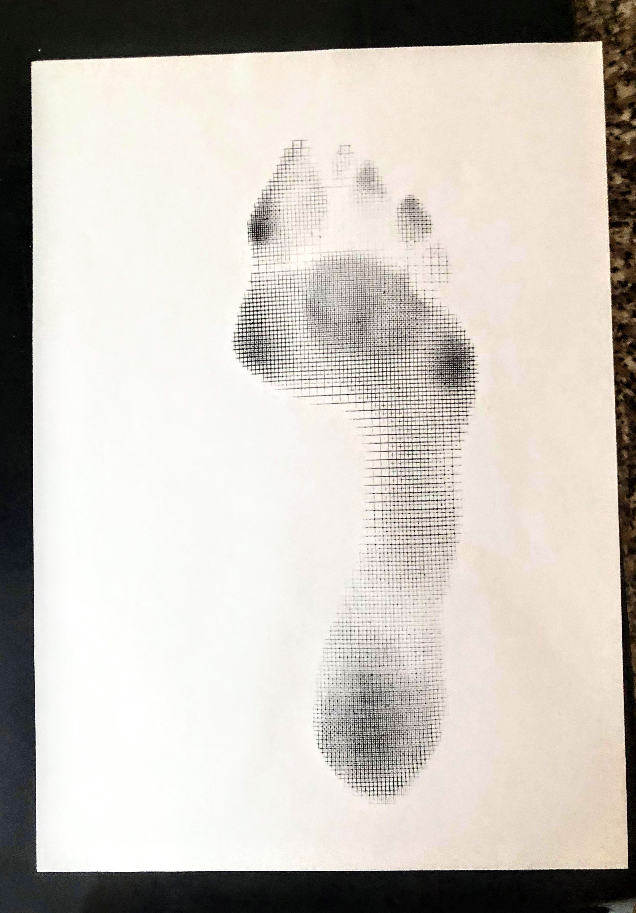
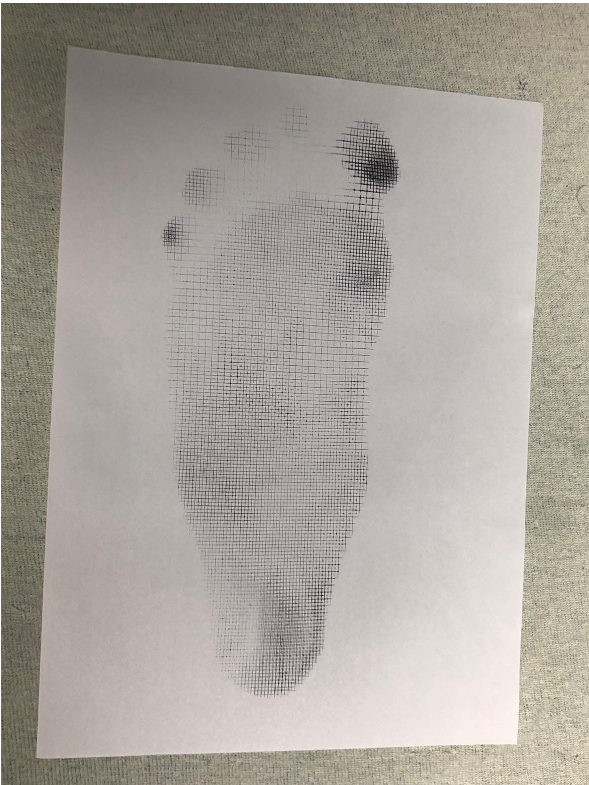

## WORK IN PROGRESS

## General info
Foot detection, analysis and diagnosis.
about diagnosis:
* alfa angle
* beta angle
* gamma angle
* heel-shin angle
* Wejsflog's ratio
* Sztriter-Godunow ratio
* Balakirew ratio

## Methods
Perspective change, edges detection, filters, algorithms, resizing etc...

## Technologies
Project created with:
* python3
* opencv
* numpy
* matplotlib

IN FUTURE: flask webserver and deployment
## RESULT 
5 foot parts found!
(0, 2.5852762640462266, 'WejsflogIndex OK')  
(0, 18.669589518156084, 'GammaIndex OK')
(0, 0.3475515596582136, 'stopa normalna')
(0, 1.0, 'stopa normalna')
(0, 3.2856111724869663, 'stopa normalna')
(1, 11.222305833974337, 'Niepoprawny kąt beta')

## Photos to analysis

